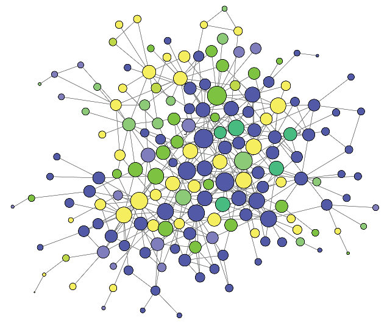

# Uezu2016

iBioID proteoimcs data from Uezu _et al.,_ 2016, published in
[Science](https://science.sciencemag.org/content/353/6304/1123.full).

To access the raw data in R, install the package with devtools, and then access
the data in `inst/extdta` using `system.file` and
[readxl](https://readxl.tidyverse.org/) (see example below). Or, if that sounds
complicated, you can simply download the raw files from this repository,
[here](./inst/extdata).

```R

devtools::install_github("soderling-lab/Uezu2016")

library(readxl)

# the Uezu2016 package contains the following files in inst/extdata:
epsd <- "ePSD_BioID-Supplementary-data.xlsx"
ipsd <- "iPSD_BioID-Supplementary-data.xlsx"

# access your system's path to the data
myfile <- system.file("extdata", ipsd, package="Uezu2016")

readxl::excel_sheets(myfile)

# [1] "Table 1" "Table 2" "Table 3" 
# ^MS info, Sample info, and the raw (peptide-level) data

df <- readxl::read_excel(myfile, sheet = 3) 

```




## References
__[1]__ Identification of an Elaborate Complex Mediating Postsynaptic Inhibition.  
Akiyoshi Uezu, Daniel J. Kanak, Tyler W.A. Bradshaw, Erik J. Soderblom, 
Christina M. Catavero, Alain C. Burette, Richard J. Weinberg, and Scott H. Soderling.  
[Science.](https://science.sciencemag.org/node/683771.full)
2016 Sep 9; 353(6304): 1123–1129. DOI: 10.1126/science.aag0821  
